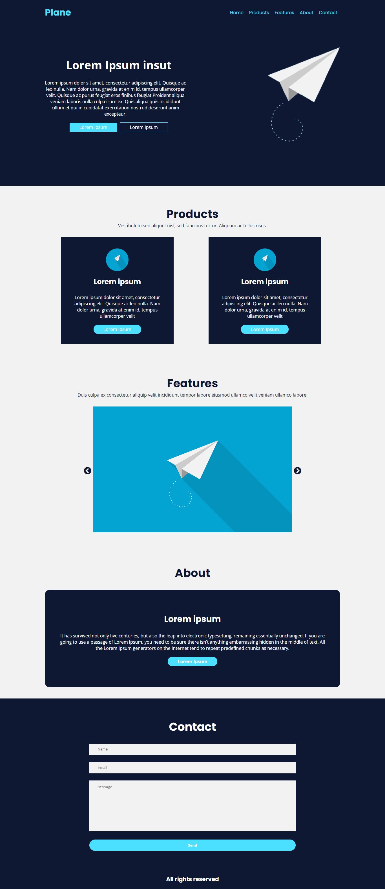

# Plane Landing Page
Essa é a "Plane Landing page", uma página que apresenta um layout responsivo e moderno. O objetivo desta página é fornecer informações sobre uma empresa fictícia chamada "Plane" e seus produtos. Sinta-se à vontade para personalizar e modificar essa página de acordo com suas necessidades. Adicione seu próprio conteúdo, imagens e estilos a fim de desenvolver uma landing page única para você ou para alguma empresa.



# Recursos
A página "Plane Landing page" possui os seguintes recursos:

- Um cabeçalho com um menu de navegação, incluindo links para diferentes seções da página.
- Um banner principal com uma imagem e texto descritivo.
- Uma seção de produtos, exibindo informações sobre os produtos da empresa.
- Uma seção de recursos, que inclui um slider com imagens dos recursos.
- Uma seção "Sobre", apresentando informações sobre a empresa.
- Uma seção de contato, com um formulário para envio de mensagens.
- Um rodapé com os direitos autorais da empresa.


# Tecnologias
As seguintes tecnologias foram utilizadas para criar a página "Plane Landing page":

- HTML: Utilizado para estruturar o conteúdo da página.
- CSS: Utilizado para estilizar a página e torná-la visualmente atraente.
- JavaScript: Linguagem de programação utilizada para adicionar interatividade e comportamento à página.
- Font Awesome: Biblioteca de ícones utilizada para adicionar ícones ao menu de navegação.
- jQuery: Biblioteca JavaScript utilizada para facilitar a manipulação do DOM e interações com os elementos da página.
- Slick Carousel: Biblioteca utilizada para criar o slider de recursos.

# Utilização

Para utilizar essa Landing Page na sua máquina siga os seguintes passos:

- Clone o repositório para sua máquina local utilizando o seguinte comando:
```bash
  git clone https://github.com/ViniciusQuintas/plane-landing-page.git
```
- Após clonar o repositório, navegue até o diretório da Landing Page no terminal:
```bash
  cd plane-landing-page
```
- Agora, abra o arquivo index.html no seu navegador para visualizar a página em ação.

# Contribuição
Se você deseja contribuir para o desenvolvimento dessa Landing page, siga os seguintes passos:

1️⃣ Faça um fork deste repositório. 
<br>
<br>
2️⃣ Crie uma nova branch para sua contribuição. 
<br>
<br>
3️⃣ Faça suas alterações no código. 
<br>
<br>
4️⃣  Certifique-se de que suas alterações não quebram o funcionamento existente da página. 
<br>
<br>
5️⃣ Faça um pull request com suas alterações. 
<br>
<br>

# Licença
Este projeto está licenciado sob a Licença MIT. Consulte o arquivo LICENSE para obter mais informações.
